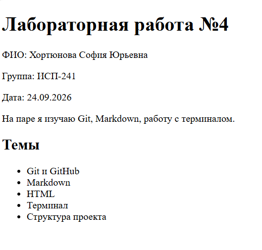

# Лабораторная работа №4 — примеры Markdown

**ФИО:** Хортюнова София Юрьевна  
**Группа:** ИСП-241  
**Дата:** 24.09.2026

---

## 1. Заголовки H1–H6

# Заголовок H1

## Заголовок H2

### Заголовок H3

#### Заголовок H4

##### Заголовок H5

###### Заголовок H6

---

## 2. Горизонтальные линии

Выше и ниже этой строки — горизонтальные линии.

---

## 3. Форматирование текста

- **жирный**
- _курсив_
- ~~зачёркнутый~~
- `моноширный`

---

## 4. Списки

### Маркированный

- Git
- Markdown
- Терминал

### Нумерованный

1. Первый
2. Второй
3. Третий

### Вложенный

- Основной пункт
  - Вложенный пункт
    - Ещё глубже

---

## 5. Цитаты

> Пример цитаты

---

## 6. Блоки кода

```bash
git status
```

| Команда    | Что делает    | Пример              |
| ---------- | ------------- | ------------------- |
| git add    | Готовит файлы | git add .           |
| git commit | Сохраняет     | git commit -m "..." |
| git push   | Отправляет    | git push            |

## Чекбоксы

- [x] Сделано
- [ ] Не сделано

## Alert-блок

> [!NOTE]
> Пример заметки

## Inline LaTeX

### Формула:

$a^2 + b^2 = c^2$

## Block LaTeX

$$
\sum_{i=1}^n i = \frac{n(n+1)}{2}
$$

## Картинка

## Ссылки


[GitHub](https://github.com/Sofia1-min/Lab4_ISRPO_Hortunova)
[README](../README.md)
